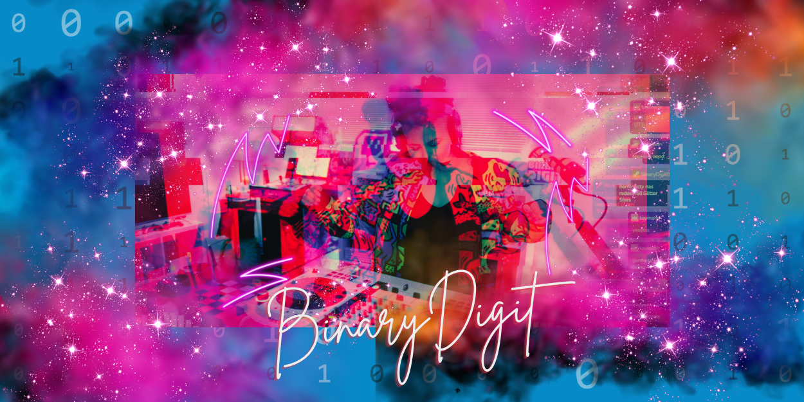

I’m B, a Xennial who grew up when the internet was young, just as I was. My family bought our first computer in 1997, and I become fascinated with how computers worked, how the web evolved, and being online a bit too much!

I'm originally from New York and currently living in Michigan.  My work background is in tech (I was a systems engineer, part time web dev, and now a manager). I would love to find more diverse folks in gaming, tech, music and all things creative. I love to travel, take photos, game on my PC, PS5 and Switch, stream, tweak code and always learning something new. ✨

I’m doing a digital overhaul for the next few months and would like to make this site a digital garden, or in my case, a _digital cafe_; a personal space to gather projects, what I'm working on, thoughts, and notes. You can read about my projects or get in touch with me below.

## Email

```hi@binarydigit.cafe```

## Contact Me

<script data-letterbirduser="binarydigit" src="https://letterbird.co/embed/v1.js"></script>

## Coffee
If you like what I do, you can buy me a coffee!
<script type='text/javascript' src='https://storage.ko-fi.com/cdn/widget/Widget_2.js'></script><script type='text/javascript'>kofiwidget2.init('Ko-fi', '#04a5e5', 'F2F321K6F');kofiwidget2.draw();</script> 
