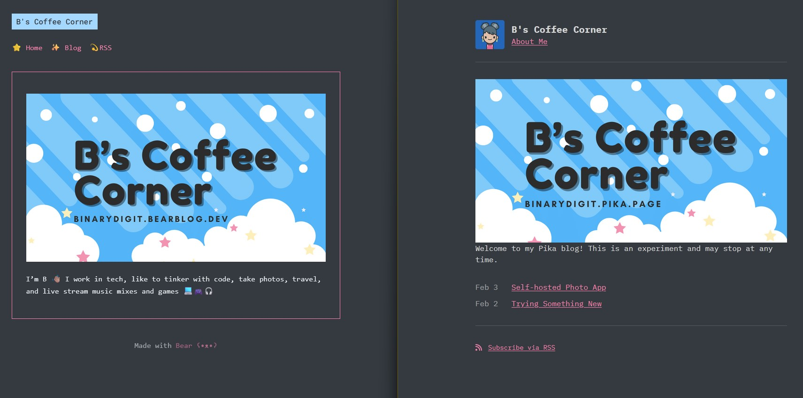

## My Week

During the week I was reading the 32bit cafe and Mastodon, and made a list of small web platforms that I wanted to try. Ever since I set up WordPress over again, I haven't been happy with the experience. It's bloated and slow, I only wrote a couple of posts, and I kept fiddling with themes and plugins instead of writing. I'm naturally a fiddler with code since I love making and changing aethestics of themes and things. The reason I'm looking for simple blogging software is to:

1) Blog more, even if they are short random thoughts. I found my old Tumblr and WordPress archives and miss reading about those parts of my life.
2) I don't really want to update Hugo (running on this site) or 11ty for blogging, it's too much work for a short post. I want a decent editor interface, with markdown and abiliity to upload photos and link from my personal gallery or some.pics.
3) I want to be able to enjoy the writing experience with good simple UI
4) I want to be able to change themes and then edit them as I want to - colors, fonts, links.
5) I don't mind spending up to $5-6 a month for a service, as long as I can export it when needed. I want to support the platform and feel that's about what I'd pay. I had micro.blog which was great, I love the activitypub integration; but sometimes complicated with theming, also confusing when looking up profiles, and things broke more frequently than I wanted.

## Down to Three

I whittled it down to [Scribbles](https://scribbles.page/), [Pika](https://pika.page/), and [Bear](https://bearblog.dev/). All services that are specfically made for micro blogging and on the small web.

I really loved the idea of Scribbles, other blog discoverability, and Vincent is wonderful and responsive, it just doesn't have enough of the above features that I wanted _right now_. I will keep afloat on updates to that service for sure!

I then signed up for Pika and Bear. I absolutely loved the easy UI of Pika. You sit down, pick a theme color, font, and you're ready to go. You are able to adjust CSS as well, but I didn't have much to change.

When I signed up for Bear, immediately I noticed how much I could customize on the free tier. I'm able to not only customize how my blog looks to the reader, but how it look to me in the dashboard CSS! I can add a basic styling to buttons (since by default it's quite ...bare🥁, and change the fonts and size while in the editor. It helps me tremendously. Herman has clear docs and for the pro plan at $5 a month you add a custom domain, image uploading (on the free tier you can only link from another source which is fine but not always ideal), has analytics (not a big deal for me but might be nice to check), run JS scripts, an email subscriber list (which I may or may not use), and ability to add code to the head and footer. You can also see a disovery list of other Bear blogs. 

For me, the winner will be Bear. Pika is also still new, so I will also be keeping an eye out for updates from the team at Good Enough. I love what they do and currently signed up for Letterbird and Album Whale. 

I look forward to more updates from both Pika and Scribbles!  And don't be surprised if I write a new update in 6 months when I change my mind to another service. 😅

If you have any other small web blog platforms send them my way on [Mastodon](https://social.lol/@BinaryDigit)! Thanks for reading 🥰 The new micro blog is at [blog.binarydigit.cafe](https://blog.binarydigit.cafe)